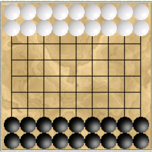

# Projeto de PFL em PROLOG

## Identificação do Trabalho e Grupo

O jogo recriado neste projeto foi o *Renpaarden*.

O grupo Renpaarden_1 é composto pelos seguintes elementos:

- Mateus Ferreira da Silva (up201906232)
- Melissa Moreira da Silva (up201905076)

## Instalação e Execução

## Descrição do Jogo

*Renpaarden*, *cavalos de corrida* em alemão, é jogado num tabuleiro quadrado de dimensões 9x9, por com dois jogadores. Cada jogador começa com 18 pedras (de cores diferentes - um jogador pretas, outro brancas), nas seguintes posições:

Na sua vez, um jogador deve mover uma das suas pedras. Estas movem-se como um cavalo de xadrez, isto é, são capazes de se deslocar múltiplos quadrados de cada vez: 1 quadrado verticalmente e 2 na horizontal ou 2 quadrados verticalmente e 1 na horizontal, fazendo então lembrar a letra "L".

Existe uma regra especial, contudo: caso uma pedra salte para um quadrado ocupado por uma pedra do adversário, o jogador pode jogar com esta de novo, o que se repete até que a pedra atinja um quadrado desocupado.

O jogo termina quando um dos jogadores consegue que todas as suas pedras atinjam a posição inicial das pedras do seu adversário.

## **Bibliografia**

http://www.di.fc.ul.pt/~jpn/gv/renpaarden.htm

https://sites.google.com/site/boardandpieces/list-of-games/renpaarden

https://boardgamegeek.com/boardgame/70925/renpaarden

