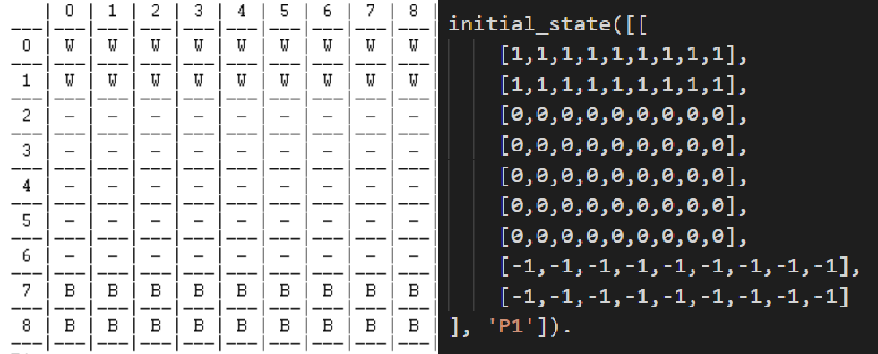
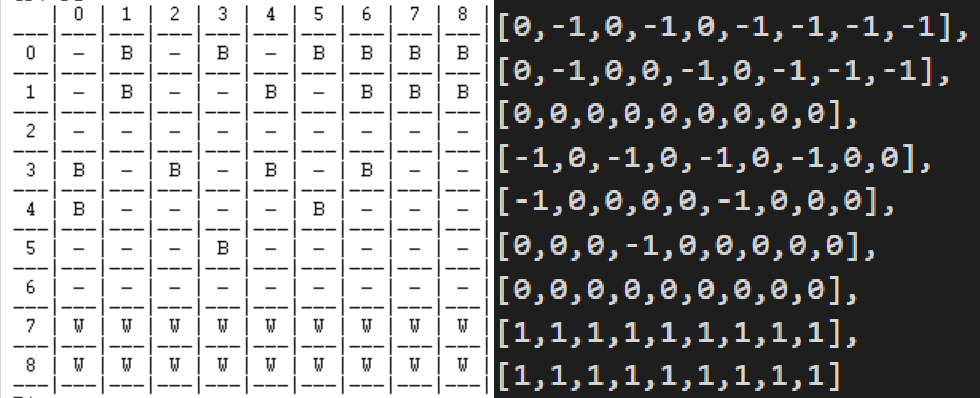
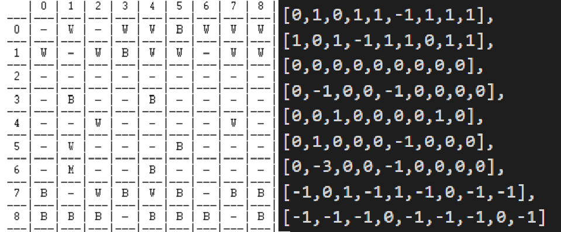
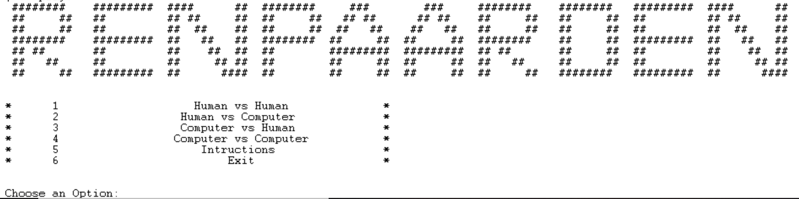
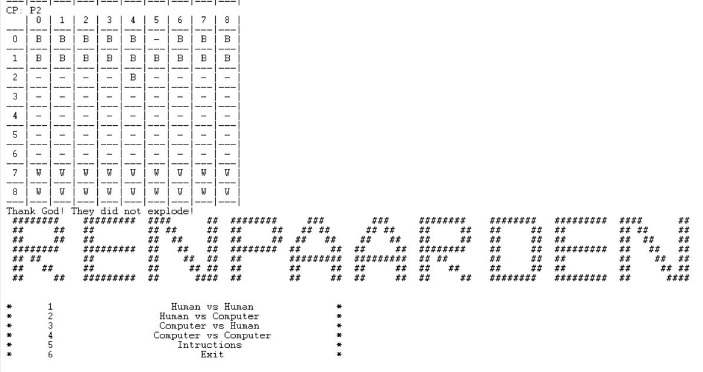

# Projeto de PFL em PROLOG

## Identificação do Trabalho e Grupo

O jogo recriado neste projeto foi o *Renpaarden*.

O grupo ***Renpaarden_1*** é composto pelos seguintes elementos:

- Mateus Ferreira da Silva (up201906232) 
- Melissa Moreira da Silva (up201905076)

Ambos os elementos contribuíram 50%, totalizando 100%.

## Instalação e Execução

Para executar o jogo, apenas é preciso consultar o ficheiro ***menu.pl***. Para executar o jogo, deve-se invocar o predicado ***play***.

## Descrição do Jogo

*Renpaarden*, *cavalos de corrida* em alemão, é jogado num tabuleiro quadrado de dimensões 9x9, por dois jogadores. Cada jogador começa com 18 pedras (de cores diferentes - um jogador pretas, outro brancas), nas seguintes posições:


Na sua vez, um jogador deve mover uma das suas pedras. Estas movem-se como um cavalo de xadrez, isto é, são capazes de se deslocar múltiplos quadrados de cada vez: 1 quadrado verticalmente e 2 na horizontal ou 2 quadrados verticalmente e 1 na horizontal, fazendo então lembrar a letra "L".

Existe uma regra especial, contudo: caso uma pedra salte para um quadrado ocupado por uma pedra do adversário, o jogador pode jogar com esta de novo, o que se repete até que a pedra atinja um quadrado desocupado.

O jogo termina quando um dos jogadores consegue que todas as suas pedras atinjam a posição inicial das pedras do seu adversário.

## Lógica do Jogo

### Representação Interna do Jogo

A representação interna do jogo é uma lista chamada *GameState*. Esta inclui um primeiro elemento *BoardState* (uma lista de listas de números que representam as peças e posições vazias - criámos um código numérico para isto) e um segundo elemento *CP* que contém a designação do jogador corrente.

Em baixo, temos um possível estado inicial de um jogo, visto por um jogador e no código (- é vazio, correspondente a 0; W é uma peça branca, correspondente a 1; B é uma peça preta, correspondente a -1).



Um estado final (ganharam as brancas).



E um estado intermédio, com uma posição com *M* (duas peças de cores diferentes), correspondente a -3.



### Visualização do Estado do Jogo

O jogo possui um *Menu* que funciona através do *Input* de números, servindo para direcionar o jogador ao modo que preferir jogar. Este está definido em ***menu.pl***.



Qualquer modo do jogo é representado da mesma forma, utilizando uma estrutura parecida a uma tabela e com índices de coordenadas para ajudar a fornecer jogadas. Imagens desta representação estão na subsecção acima. A representação é *impressa* sempre que *displayGame* é chamado - este predicado e seus auxiliares estão em ***print.pl***.

### Execução de Jogadas

A lógica do jogo é simples em termos teóricos: *Renpaarden* joga-se com dois jogadores, alternando a vez entre estes. Isto é conseguido com um ciclo de jogo simples, que se pode ver nos nossos predicados de prefixo *loop*. Por simplicidade, iremos focar-nos no *loop* para o jogo entre dois humanos (o primeiro que fizemos), ***loop/2***.

```perl
loop(-1, _).
loop(I, [BoardState, CP]) :-
    askForInput(R, C, V, H, [BoardState, CP]),
    (move([R, C, V, H], [BoardState, CP], NewGameState, 'Human')
    ->(game_over(NewGameState, Winner)
      -> play
      ; loop(0, NewGameState))
    ; loop(I, [BoardState, CP])).
```

A sequência de jogo passa por pedir ao jogador *input* correspondente a uma jogada. Isto é feito em ***askForInput/5*** (definido em ***input.pl***), onde são validados os valores fornecidos: ***R*** e ***C*** definem coordenadas do tipo *(y, x)*, entre 0 e 8. Já ***V*** e ***H*** apenas podem seguir movimentos em L, como o Cavalo do Xadrez. O predicado abaixo certifica-se disso.

```perl
check_horizontal_and_vertical(H,V):-
    ((H==2; H== (-2)),(V==1; V== (-1)));
    ((H==1; H== (-1)),(V==2; V== (-2))).
```

O predicado mais importante desta secção deverá ser ***isValidPos/2***, visto que esta verifica que a jogada constituída por ***R***, ***C***, ***V*** e ***H*** é válida: (R + H, C + V) tem de resultar numa posição interior ao tabuleiro, além de verificar que ***R*** e ***C*** selecionam uma peça correta (um jogador só pode jogar peças da sua cor).

```perl
isValidPos('').
isValidPos([R, C, V, H], [BoardState, CP]) :-
    H1 is R + (H),
    V1 is C + (V),
    nth0(R, BoardState, Line),
    nth0(C, Line, Col),
    (isPlayer1(CP)
    -> (isWhite(Col)
        -> (H1 =< 8, H1 >= 0, V1 =< 8, V1 >= 0
            ; error('The computed position is not within the board.'), nl, fail
           )
        ; isWhite(Col), !
       )
    ; (CP \= 'P1', isBlack(Col)
      -> (H1 =< 8, H1 >= 0, V1 =< 8, V1 >= 0
         -> isValidPos('')
         ; error('The computed position is not within the board.'), nl, fail
         )
      ; isBlack(Col), !
      )
    ).
```

Quando o predicado anterior passa afirmativamente, ***move/4*** é o predicado onde tudo o resto acontece: este executa a jogada, o que requer muitas substituições sucessivas nas listas de *BoardState*. Isto é feito com ***replace/4*** (um predicado elaborado por nós para maior facilidade, definido em ***utils.pl***) e com o predicado do módulo *lists* ***nth0/3*** para aceder ao elemento correto.

***move/4*** lida com muitos casos:

- Um espaço vazio (0) que passa a ser ocupado por uma peça branca (1);
- Igual ao anterior, mas com uma peça preta (-1);
- Uma peça branca ou preta vai para uma posição ocupada por uma peça de cor contrária (-3);
- Uma posição duplamente ocupada (-3) passa a ser ocupada por uma só peça com um salto do jogador que a fez ficar duplamente cheia.

Os dois últimos casos correspondem à regra especial mencionada anteriormente: esta é a única secção do predicado que lida (embora indiretamente - chama um predicado que lê os dados necessários) com ***input*** do utilizador, visto que, quando uma posição é ocupada por duas peças, a última peça a entrar tem de ser movida novamente.

Não existe nada de muito especial: como o jogador não pode jogar outra peça até esvaziar a posição que está duplamente ocupada, ***R*** e ***C*** ficam imediatamente definidos como essa posição. ***V*** e ***H***, contudo, são à discrição do jogador - até é possível, como com qualquer outra peça do jogo, andar "para trás" no tabuleiro (isto é, andar na direção contrária àquela das linhas que um jogador deve ocupar). Esta decisão foi feita para que casos desta regra especial como este não bloqueiem um jogador e, mais a pensar em jogadores humanos, permitir estratégias mais audazes.

Além disto, ***move/4*** impede um jogador de ocupar duplamente uma posição com duas peças da mesma cor e invoca o predicado de mudança de jogador, ***changePlayer/2***.

### Final do Jogo

O final do jogo é testado com o predicado ***game_over/2***. O teste passa por verificar as 2 primeiras e 2 últimas linhas do tabuleiro: para o jogador 1, se as duas últimas estiverem preenchidas pelas suas peças brancas (1), então este ganhou; para o jogador 2, vice-versa, com as suas peças pretas (-1).

```perl
game_over(-1, 'P1').
game_over(-1, 'P2').
game_over([BoardState, CP], Winner):- 
   (isPlayer2(CP)
   -> check_WhitePlayer_won(BoardState, CP, Winner)
   ; check_BlackPlayer_won(BoardState, CP, Winner)
   ).
   
check_WhitePlayer_won(X, Y, Winner) :- 
   nth0(7, X, Row), 
   \+list_member(0, Row),
   \+list_member(-1, Row),
   nth0(8, X, Row1), 
   \+list_member(0, Row1), 
   \+list_member(-1, Row1),
   game_over(-1, 'P1').

check_BlackPlayer_won(X, Y, Winner):-
   nth0(0, X, Row), 
   \+list_member(0, Row), 
   \+list_member(1, Row), 
   nth0(1, X, Row1), 
   \+list_member(0, Row1), 
   \+list_member(1, Row1),
   game_over(-1, 'P2').
```

### Lista de Jogadas Válidas

O predicado **valid_moves/2** gera todas as jogadas possíveis. Isto serve para permitir os modos de jogo contra o computador ou mesmo o jogo entre dois computadores. O predicado divide-se em duas partes. Inicialmente, procuramos no tabuleiro do estado atual do jogo todas as posições que o computador pode jogar - no máximo, serão 16 posições. À medida que peças se colocam nas linhas horizontais extremas, este número diminui - para ajudar nesta verificação, temos ***doesNotGoBack/2***.

Geram-se as posições válidas com ***findall/3***. 

```perl
doesNotGoBack(R, CP) :-
    (isPlayer1(CP)
    -> R < 7
    ; R > 1).

%valid_pos(-GameState, +Positions)
valid_pos([BoardState, CP], Positions) :-
    findall(R-C,
    (
        nth0(R, BoardState, Line),
        nth0(C, Line, Col),
        (isPlayer2(CP)
        -> isBlack(Col)
        ; isWhite(Col)),
        doesNotGoBack(R, CP)
    ),
    Positions).
```

Com estas posições, geramos então, mais uma vez, com ***findall/3***, todas as jogadas válidas possíveis.

```perl
valid_moves_aux(GameState, [], Moves) :- !.
valid_moves_aux([BoardState, CP], [Head|Tail], Moves) :-
    unzipPos(Head, R, C),
    findall([R, C, V, H],
    (
        valid_V_H(V, H),
        H1 is (R) + (H),
        V1 is (C) + (V), 
        H1 =< 8,
        H1 >= 0,
        V1 =< 8,
        V1 >= 0,
        nth0(R, BoardState, Line),
        nth0(C, Line, Col),
        (isPlayer2(CP)
        -> isBlack(Col)
        ; isWhite(Col)),
        nth0(H1, BoardState, DestinationLine),
        nth0(V1, DestinationLine, DestinationCol),
        (isEmpty(DestinationCol) ;
        (isPlayer2(CP)
        -> isWhite(DestinationCol)
        ; isBlack(DestinationCol))) %Needs to go to an empty thing.
    ), 
    IntermediateMoves),
    valid_moves_aux([BoardState,CP], Tail,MoreIntermediatePlays),
    append(IntermediateMoves,  MoreIntermediatePlays, Moves).
```

No *goal* fornecido a esta invocação de ***findall/3***, verificamos tudo o que normalmente é feito com mais predicados num jogo de humano contra humano.

### **Jogada do Computador**

A jogada do computador é sempre aleatória por não implementarmos o nível 2 da inteligência artificial. Limita-se a escolher um número no intervalo definido pelo tamanho da lista de jogadas válidas e efetua essa jogada utilizando, mais uma vez, ***move/4***.

Visto guardarmos os valores possíveis em pares (R-C) ou listas ([R, C, V, H]), temos predicados de prefixos *unzip* que passam para elementos singulares os valores destes, para serem usados por outros predicados de forma mais simples.

Testámos um jogo de PC vs. PC e ele terminou, em baixo, pode ver-se o que acontece.



## Conclusão

O presente trabalho permitiu-nos desenvolver uma melhor apetência com a linguagem de programação *Prolog*, ajudando na sua compreensão e melhor utilização. Cremos ter conseguido um jogo funcional e apelativo visualmente apesar das limitações gráficas.

Como melhorias do trabalho, poderíamos mencionar o facto de não termos elaborado (por escassez de tempo), o segundo nível da inteligência artificial. Em termos de problemas conhecidos, testámos o código na melhor da nossa habilidade e acreditamos ter resolvido todos os encontrados.


## **Bibliografia**

http://www.di.fc.ul.pt/~jpn/gv/renpaarden.htm

https://sites.google.com/site/boardandpieces/list-of-games/renpaarden

https://boardgamegeek.com/boardgame/70925/renpaarden

